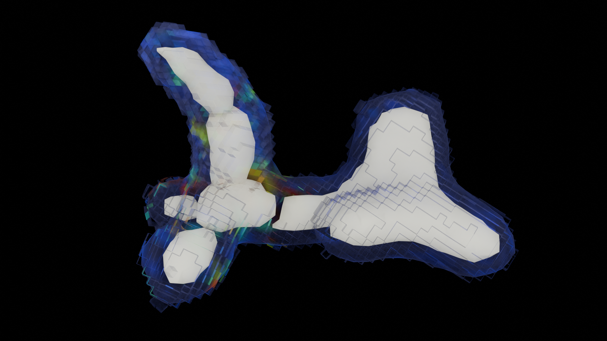
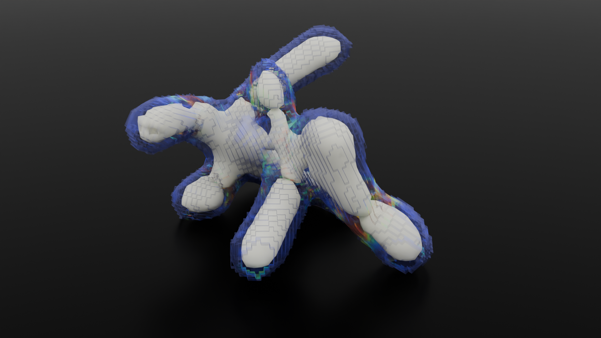
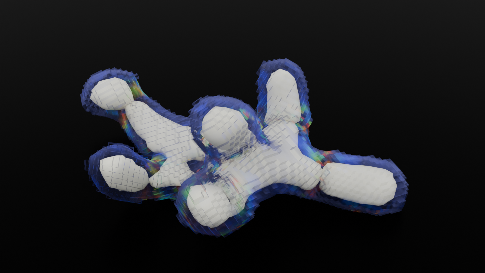
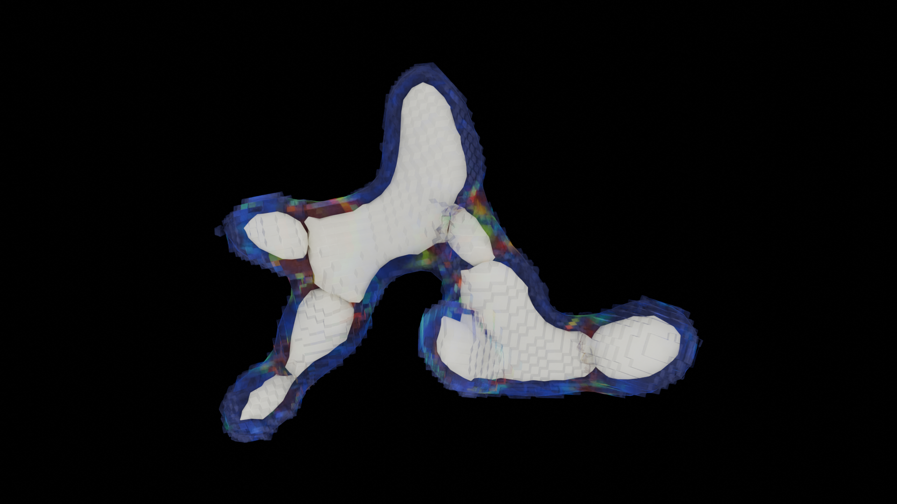

# Generating Freeform Endoskeletal Robots
[[Paper]](https://arxiv.org/pdf/2412.01036)    [[Website]](https://endoskeletal.github.io/)

**Status**: Accepted at ICLR 2025 Conference

**Authors**: Muhan Li, Lingji Kong, Sam Kriegman

## Evolved robots!


|  |  |  |
|--------------------------|--------------------------|--------------------------|
|  |  |  |

--- 

## Methodology

1. **Simulation Platform**: We built a voxel-based simulation platform that enables two-way coupling between flexible (soft) and rigid components of the robots.

2. **Encoding Morphology**: A variational autoencoder (VAE) was used to generate and optimize robot structures, encoding valid designs into a 512-dimensional latent space.

3. **Control Mechanism**: We built a universal controller using a graph transformer, and aligns the robot’s proprioceptive sensory input from voxels
    with its skeletal graph sensor inputs.

4. **Optimization Process**: Designs were optimized using Proximal Policy Optimization (PPO) within a reinforcement learning framework, while evolutionary strategies (CMA-ES) iteratively improved designs based on fitness scores.

5. **Task Environments and Adaptation**: Robots were tested in diverse task environments (e.g., flat ground, potholes, mountain ranges) to evolve designs that could overcome complex obstacles.

## Repository Structure

The repository is organized into the following directories:

- **`model`**: Models for VAE and controllers.
- **`rl`**: Reinforcement learning implementation.
- **`scripts`**: Scripts for running experiments.
- **`sim`**: Simulation platform implementation.
- **`synthetic`**: Synthetic training data generation.
- **`utils`**: Utility functions and helpers.

## VAE checkpoint
We release the vae checkpoint we used for all our experiments on [google drive](https://drive.google.com/file/d/1pT-KVPKoEwXMwTKQN2dL2cke8884kRRC/view?usp=sharing).

## Usage
0. Please make sure that you are running with linux environment, preferably Ubuntu 22.04 to make sure the least amount
of work to use everything. First, enter the root directory of the repository. And export the path as `PYTHONPATH`.

    ```bash
    export PYTHONPATH=$(pwd)
    ```
    
1. The Rise simulator is the underlying voxel based platform for our experiments. To run it, a CUDA compatible GPU is required, we support GPUs with at least CC 6.0 capability.
   
   For your convenience, we have compiled binary libraries importable by python, please prepare the following environment:
   1. With conda, python 3.10 and cuda 11.8:
      ```
      conda create -n rise
      conda activate rise
      conda install -c nvidia/label/cuda-11.8.0 -c conda-forge cuda=11.8.0 boost=1.85.0 gcc=11.3.0 gxx=11.3.0 hdf5=1.14.3 python=3.10.15 sysroot_linux-64=2.28 zlib=1.3.1
      ```
   2. With conda, python 3.12 and cuda 12.1:
      ```
      conda create -n rise
      conda activate rise
      conda install -c nvidia/label/cuda-12.1.1 -c conda-forge cuda=12.1.1 boost=1.85.0 gcc=11.3.0 gxx=11.3.0 hdf5=1.14.3 python=3.12.0 sysroot_linux-64=2.28 zlib=1.3.1
      ```
   3. With Ubuntu 22.04, and cuda 11.8 toolkit installed from [Nvidia](https://developer.nvidia.com/cuda-11-8-0-download-archive):
      ```
      sudo apt install python3 python3-venv libboost-dev libhdf5-dev
      python3 -m venv env
      source env/bin/activate
      ```
   Note, the conda environment before version 23.10.0 is using the classic solver, newer versions has enabled the mamba
   solver and is much faster at installing the environment, you may update your current conda base environment to use the
   newest solver from [here](https://www.anaconda.com/blog/a-faster-conda-for-a-growing-community).

   Finally, copy the library under corresponding rise-lib directory to the directory of this repository, for example:
      ```
      cp ./rise-lib/conda_py310_cu118/rise.cpython-310-x86_64-linux-gnu.so ./
      ```
2. With your activated conda or python environment, install the required dependencies:
   ```bash
   pip install -r requirements_cu118.txt
   # or
   pip install -r requirements_cu121.txt
   ```
3. Train Morphology VAE:
   ```bash
    python scripts/train_vae.py
   ```
   You may skip this step and put the downloaded VAE checkpoint in the `data/ckpt` directory.

4. Run one of the experiments (with VAE trained, or downloaded):
   ```bash
   python scripts/evolve_rl_basic.py
   ```

## Visualize simulation
The RISE simulator is still a work in progress, and currently, the beautiful animations in this paper
are rendered by blender. In our future work, the completed simulator will come with ease to use 
visualization tools. For now, please be patient, and we will keep you updated.

Usually, we don't save the full record file for evolved robots to save space. 
To visualize the history of a robot, you can use the following script `scripts/generate_robot_history.py`.

The `data/rl-result/<some-date>/debug-logs` will save the evolution history, by default, we save
history as `.h5_history` format. You can use `visualize/video_simple.ipynb` to generate a blender
animation file, which can be then replayed, or rendered to a video file.

If you find any problem in visualizing the robots, please let us know in the issue tracker.

## RISE simulator documentation
We tried our best to document the still-in-progress simulator interface in [rise.md](rise.md), please
let use us know if you find any usage issue with our current compiled version. But please be aware that
the simulator is not completed, and future versions will look very different from the current prototype.

Thank you for your understanding. 

If you find any unclear part of the simulator, please let us know in the issue tracker.

## Citation
```bibtex
@misc{li2024generatingfreeformendoskeletalrobots,
      title={Generating Freeform Endoskeletal Robots}, 
      author={Muhan Li and Lingji Kong and Sam Kriegman},
      year={2024},
      eprint={2412.01036},
      archivePrefix={arXiv},
      primaryClass={cs.RO},
      url={https://arxiv.org/abs/2412.01036}, 
}
```
